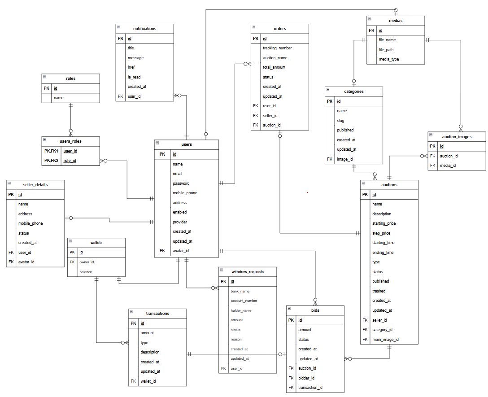
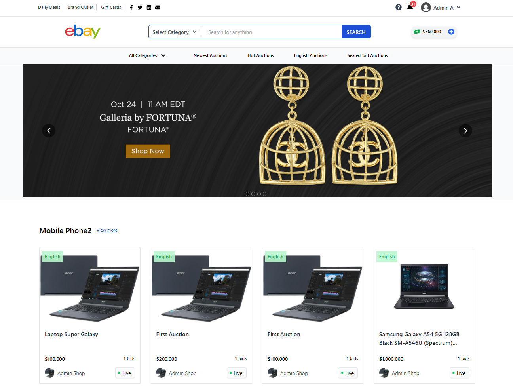
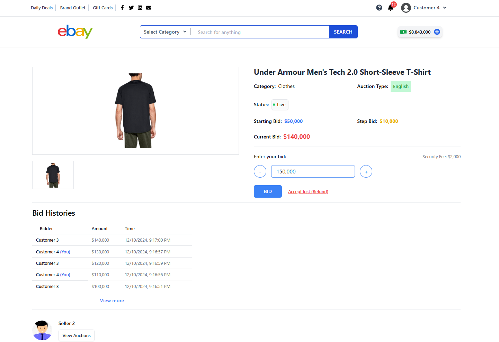
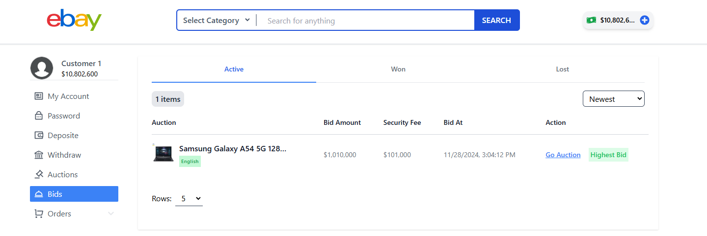
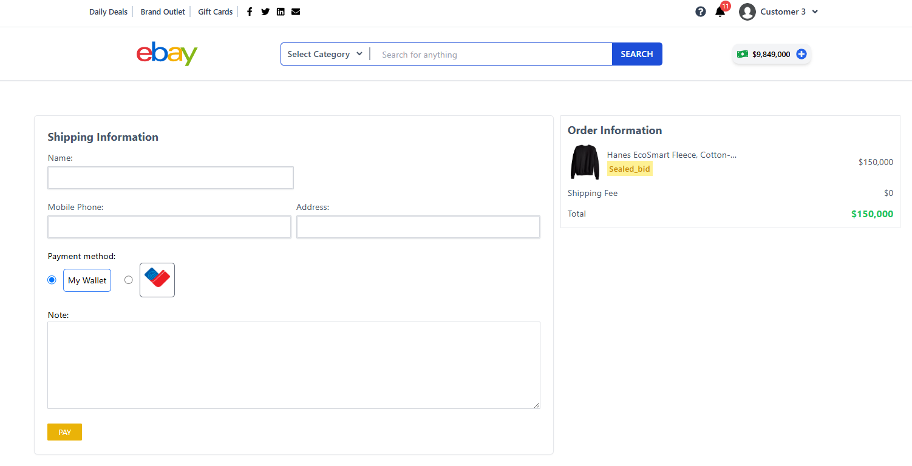
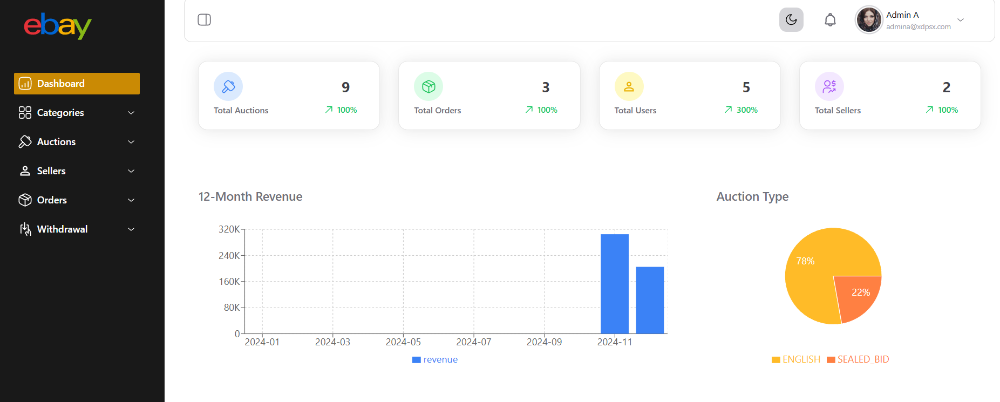
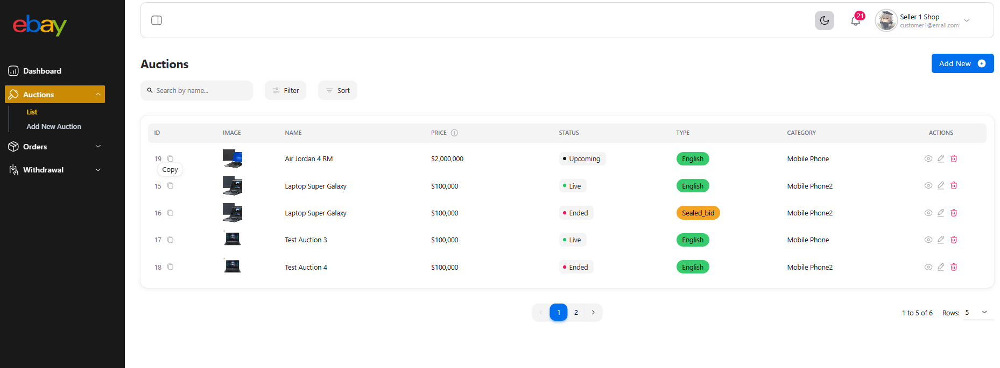
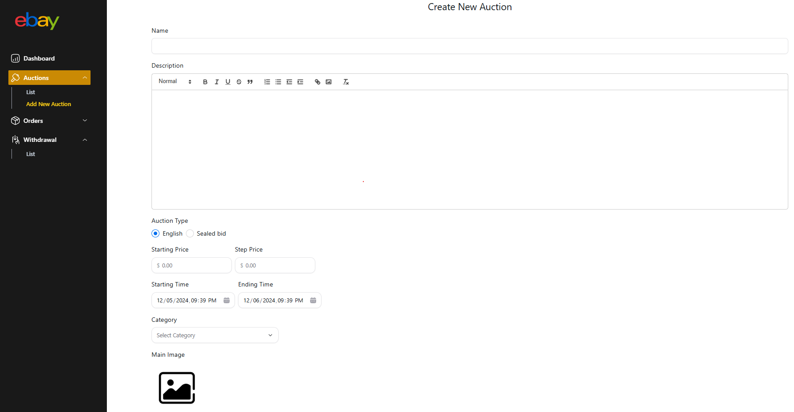

# About Project

This project is a real-time auction platform that supports two types of auctions: **English Auction** and **Sealed-Bid Auction**. The application also uses **TF-IDF** and **Levenshtein Distance** for its search functionality.

## Technologies

- Java 17
- Spring boot 3.3
- ReactJs
- Redux Tookit
- MySQL
- Redis
- WebSocket

## ERD

## Screenshots

<table>
    <thead>
        <tr>
            <th>Storefront</th>
            <th>Backoffice</th>
        </tr>
    </thead>
    <tbody>
        <tr valign="top">
            <td>
                <!--  -->
                
                 
                
            </td>
            <td>
                
                
                
            </td>
        </tr>
    </tbody>
</table>